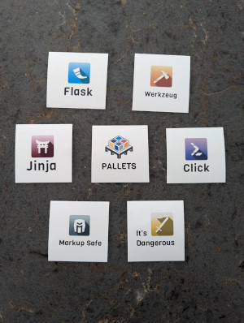

Flask has recently simplified its logo design, departing from its previous pepper-like
symbol. This simplification has had a mixed result, with some users preferring the old peppery style and others
preferring the new simplified design.

All Pallets-associated project logos have also been streamlined to match the new branding including Pallets itself.

[Georgically](https://elk.zone/mas.to/@georgically@fosstodon.org) was the designer of all the new logos.
